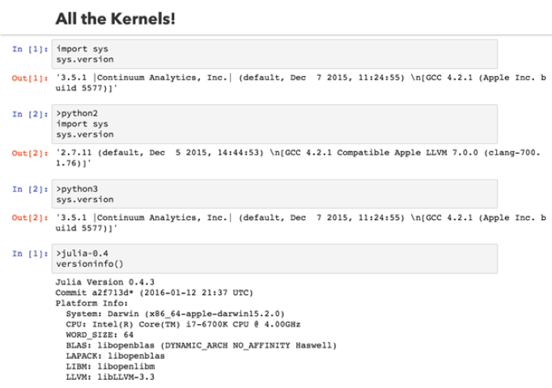
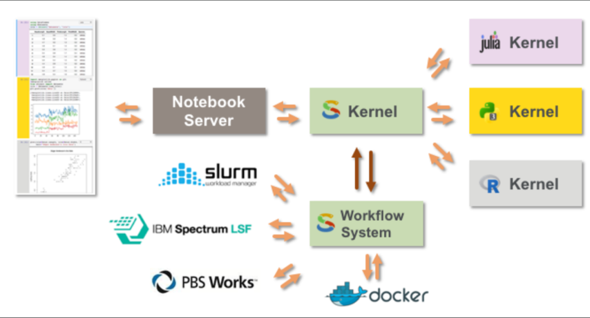
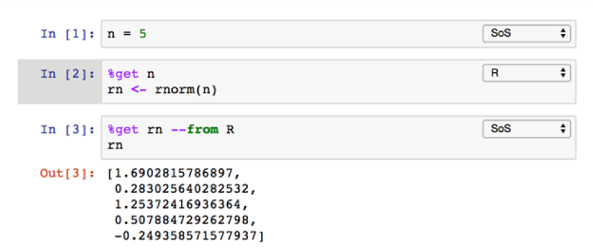
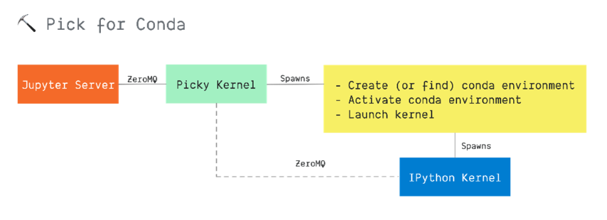
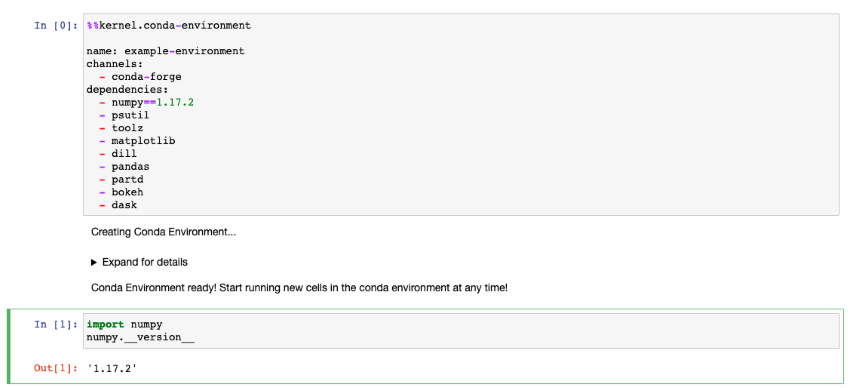

# Summary

This proposal discusses transmitting cell metadata as part of the Jupyter
Messaging Protocol execute message requests. It is up to the kernel to interpret
this metadata based on the scenario. 

# Motivation

By transmitting cell metadata inline with the execute message request, Jupyter
implementations will have a reliable channel to transmit additional metadata to
the kernel. Extensions can also use this channel to transmit additional
information that was often transmitted using magic commands. Here are some use
cases for this proposal:

-   Automatically route requests to an appropriate kernel via libraries like
    [allthekernels](https://github.com/minrk/allthekernels) without need for
    additional metadata within the cell itself
-   Create or find a conda environment without needing to use magics, like
    [pick](https://github.com/nteract/pick)
-   Support polyglot (more than one language/kernel within a single notebook)
    scenarios, like [sos](https://vatlab.github.io/sos-docs/)
-   Provide hints to the kernel for localization purposes, like how the
    ACCEPT_LANGUAGE HTTP header works
-   Provide hints to the kernel about client capabilities, like how web browser
    client capabilities hints works

# Guide-level explanation

Transmitting cell metadata enables many scenarios. Some of the scenarios are
briefly described in the Motivation section. In this section, we'll consider a
scenario in more detail: running cell code using a specific kernel. 

Today you'd typically have the user include a magic command in the cell to
identify the kernel. This interferes with other extensions that may want to use
the contents of the cell, e.g., autocomplete providers would now need to be
aware of and ignore the syntax of magics.

## Simple example

For example, in the [allthekernels](https://github.com/minrk/allthekernels)
project, users select the kernel using a `><language>` command:

```R
>python3
1+1
```

But in our example, let's imagine that we use cell metadata to specify the
kernel instead. Now, let's consider a minimal JSON fragment for the above cell: 

```json
{
  "cell_type" : "code",
  "execution_count": 1, 
  "metadata" : {
    "kernel": "python3",
  },
  "source" : "1+1",
}
```

The cell metadata dict contains an entry that specifices that the `kernel` is
`python3`. But where did the `"kernel": "python3"` metadata come from? What
wrote it into the cell metadata in the first place? 

Elaborating a bit more on the user experience here, you could imagine a client
extension providing some additional UI such as a cell drop-down that lets the
user pick from a list of installed kernels on the user's machine. The user picks
one, and the kernelspec is written to that cell's metadata.

In this example, there is also a corresponding `allthekernels` kernel that is
installed on the user's machine that knows how to multiplex between different
kernel processes that are running on the user's machine. When the user runs the
cell, the Jupyter implementation will send an
[execute](https://jupyter-client.readthedocs.io/en/stable/messaging.html#execute)
message to the kernel. 

Here's a minimal representation of the execute message for the above cell:

```js
{
  "header" : {
      "msg_id": "...",
      "msg_type": "...",
      //...
  },
  "parent_header": {},
  "content": {
    "code": "1+1",
    "metadata": {
      "kernel": "python3", 
    },
  },
  "content": {},
  "buffers": [],
}
```
 
In this case the `allthekernels` kernel sees the `"kernel": "python3"` entry
in the message, and locates and activates a child kernel to handle the request,
and passes the message onto the child kernel for processing.

There could be other cell metadata that was transmitted from the client as well.
Some of that metadata could have been put there by client extensions, like in
the case of `allthekernels`. Other metadata could be put there by the Jupyter
implementation itself, e.g., language or client capabilities like screen size.

## Metadata Key Conflicts

There is the potential for conflicts across extensions that want to add their
own cell metadata to notebook file. We recommend that extensions namespace their
metadata keys to minimize the possibility of conflicts between extensions. For
example, in the `allthekernels` case it could look like:

```json
{
  "cell_type" : "code",
  "execution_count": 1, 
  "metadata" : {
    "allthekernels:kernel": "python3",
  },
  "source" : "1+1",
}
```

## Kernels declaring the need for Cell Metadata

Kernels should have a way to declare that they require metadata to be sent. For a 
kernel like `allthekernels` it *needs* to have cell metadata that tells 

# Reference-level explanation

Cell metadata will be transmitted to the kernel as part of the
[Execute](https://jupyter-client.readthedocs.io/en/stable/messaging.html#execute).
The general form of a message is:

```js
{
  "header" : {
    "msg_id": "...",
    "msg_type": "...",
    //...
  },
  "parent_header": {},
  "metadata": {},
  "content": {},
  "buffers": [],
}
```

Different message types have different schemas for the `content` dict. The
schema of the `content` dict of an Execute message follows:

```js
content = {
  // Source code to be executed by the kernel, one or more lines.
  "code" : str,

  // A boolean flag which, if True, signals the kernel to execute
  // this code as quietly as possible.
  // silent=True forces store_history to be False,
  // and will *not*
  //   - broadcast output on the IOPUB channel
  //   - have an execute_result
  // The default is False.
  "silent" : bool,

  // A boolean flag which, if True, signals the kernel to populate history
  // The default is True if silent is False.  If silent is True, store_history
  // is forced to be False.
  "store_history" : bool,

  // A dict mapping names to expressions to be evaluated in the
  // user's dict. The rich display-data representation of each will be evaluated after execution.
  // See the display_data content for the structure of the representation data.
  "user_expressions" : dict,

  // Some frontends do not support stdin requests.
  // If this is true, code running in the kernel can prompt the user for input
  // with an input_request message (see below). If it is false, the kernel
  // should not send these messages.
  "allow_stdin" : True,

  // A boolean flag, which, if True, aborts the execution queue if an exception is encountered.
  // If False, queued execute_requests will execute even if this request generates an exception.
  "stop_on_error" : True,
}
```

We propose the addition of a new `metadata` dict to the `content` dict schema in
[nbformat](https://nbformat.readthedocs.io/en/latest/). This will be used to
transmit the cell metadata for the executed cell. 

In cases where Jupyter extensions generate their own metadata, that keys for the
metadata should be namespaced using an extension-specific prefix. The prefix is
ideally human-readable and identifies the extension that wrote the metadata.
There is no current provision to guarantee global uniqueness for these prefixes
in a way that other technologies, e.g., XML Namespaces do using URIs.

Below is a nominal example of both of these proposals in action. This is a
fragment of a notebook that contains a cell to be executed. Note that the
`kernel` attribute is namespaced using `allthekernels` and the existing Jupyter
attributes `collapsed` and `scrolled` are not namespaced.

```js
{
  "cell_type" : "code",
  "execution_count": 1, 
  "metadata" : {
    "allthekernels:kernel" : "python3", 
    "collapsed" : True, 
    "scrolled": False, 
  },
  "source" : "1+1",
  "outputs": [{
    "output_type": "stream",
    ...
  }],
}
```

Below is the corresponding EXECUTE message:

```js
{
  "header" : {
      "msg_id": "...",
      "msg_type": "...",
      //...
  },
  "parent_header": {},
  "content": {
    "code": "1+1",
    "metadata": {
      "allthekernels:kernel": "python3", 
      "collapsed": True, 
      "scrolled": False, 
    },
  },
  "content": {},
  "buffers": [],
}
```

# Rationale and alternatives

We considered another approach for transmitting the cell metadata before we
arrived at the recommendation in this document:

Transmitting the metadata as a new dict in the EXECUTE message as shown in this
nominal example:

```js
{
  "header" : {
      "msg_id": "...",
      "msg_type": "...",
      //...
  },
  "parent_header": {},
  "metadata": {
    "allthekernels:kernel": "python3", 
    "collapsed": True, 
    "scrolled": False, 
  },
  "content": {
    "code": "1+1",
  },
  "content": {},
  "buffers": [],
}
```

If the proposal is not accepted, we will miss an opportunity to improve 
the ability to send out-of-band information to the kernel with the EXECUTE
message. Scenarios like polyglot notebooks, or adaptive rendering based
on changes to the user's browser window size or graphics settings would
not be realized.

# Prior art

## allthekernels

`allthekernels` uses a special syntax ("> __kernelspec__") within the cell to
specify the kernel to use to run the code in the cell. This would be replaced 
by writing the kernelspec as cell metadata and transmitting it to the kernel
as described earlier in this document.



[GitHub](https://github.com/minrk/allthekernels)

## Script of Scripts (SoS)

`SoS` is a combination of a meta-kernel (authors call it a "super kernel") that
controls a set of child kernels and magic commands to identify the kernel to
target in a cell. It also provides a shared context in the “super kernel” to
share variables and data between different kernels. Requires an extension to
manage language metadata (see screenshot below)




[GitHub](https://github.com/vatlab/sos-notebook)
[JupyterCon Presentation](https://www.youtube.com/watch?v=U75eKosFbp8)
[Documentation](https://vatlab.github.io/sos-docs/notebook.html#content)

## nteract pick

`pick` is a kernel proxy that uses magics to specify an existing conda
environment to use or an environment to create to run code in the notebook.




[Github](https://github.com/nteract/pick)

# Unresolved questions

We would like to make decisions about:

- Whether the cell metadata is transmitted as a new dict in the EXECUTE message,
  or whether it is transmitted as a new dict in the content field of the EXECUTE
  message.
- Decide whether kernels need to explicitly declare the metadata that they need,
  and if so, the mechansim for communicating that declaration to the Jupyter
  implementation.

# Future possibilities

This proposal will add a new foundational capability to Jupyter: the ability to
transmit additional information to the kernel that the kernel can use to make
better decisions about how it will execute the user's code. It will make it much
more straightforward to have independent collaboration on polyglot notebooks,
notebooks that contain code in more than one programming language.
